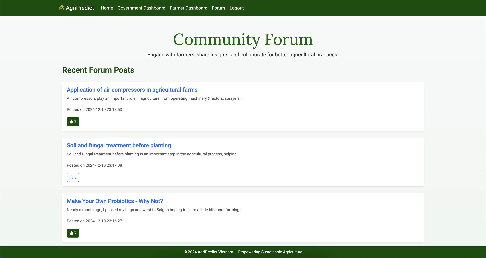

# Total Food Production Predictor (Vietnam)
Vietnam, a major agriculutral producer in Southeast Asia, dedicates approximately 40% of its land to farming, with crops like rice, coffee, and rubber serving as key economic and food security drivers. However, the agricultural sector is increasingly challenged by unpredictable rain, rising temperatures, over-reliance on fertilizers, and lastly, socio economic pressures. Thus, the goal of the website is to enable government officials and farmers to accurately predict total crop production (tonnes) in Vietnam. 

Farmers and government officials will be able to utilize the total crop production predictor, by providing the following necessary inputs, such as:

#### Environmental Variables:

**1. Total Precipitation (mm)**: Water availability is critical for crop growth. However, excessive or insufficient precipitation can lead to lower yields.

**2. Average Temperature (°C)**: Temperature affects crop growth cycles and the viability of specific crops.

#### Agricultural Variables:

**3. Total Arable Land (hectares)**: The amount of land available for cultivation directly impacts total production.

**4. Fertilizer Consumption (kg/hectare)**: Fertilizers enhance soil fertility, increasing productivity, but excessive use may lead to diminishing returns.

#### Socio-economic Variables:

**5. GDP (million USD)**: Reflects the economic capacity to invest in agricultural infrastructure and technologies.

**6. Population (people)**: Indicates food demand and labor availability for agriculture.


## Installation

### Install Git
You need to have Git to do the project. Download and install the software according to your OS:

- Windows: [Git for Windows](https://git-scm.com/downloads/win)

- Mac OS: [Git for MacOS](https://git-scm.com/downloads/mac)


### Downloading Repository
**1. Access your folder**

Clone the github repository from Github. On your laptop's terminal or Git bash, type the following:
```sh
git clone https://github.com/TristanNguyen04/AgriPredict-Vietnam
```


**2. Access the AgriPredict**

Once you have downloaded the repository, you can go to the repository and to the folder called ```webapp```.

Windows:
```sh
cd ~/AgriPredict-Vietnam/webapp
dir
```


Unix/MacOS:
```sh
cd ~/AgriPredict-Vietnam/webapp
ls
```
The last command should output the following:

```sh
app
app.db
application.py
config.py
Pipfile
Readme.md
```
**3. Create Virtual Environment**

*Please utilize anaconda prompt or terminal to do the following steps.*

Windows: 
```sh
>
```
while the MACOS/Linux prompt will be represented by:

```sh
$
```

Go to the root folder `webapp`

```sh
> cd %USERPROFILE%\AgriPredict-Vietnam\webapp
```
```sh
$ cd ~/AgriPredict-Vietnam/webapp
```

Ensure that you have installed `pipenv` package.
```sh 
python -m pip install --user pipenv
```
> **Note**: If you have not installed the relevant packages specified in the `Pipfile`, with `webapp` as root folder.


```sh
python -m pipenv install
python -m pipenv shell
```
### Launch Website
Ensure that you have downloaded the relevant packages before running the command below. Ensure that you are in the root folder `webapp`
```sh
flask run
```

You should see a local IP address being displayed, copy the ip address to your web browser to access the website.

```sh
* Running on http://127.0.0.1:5000 
```
>**Note**: Ctrl+C (Cmd+C on Mac) in the terminal to close the website.


## Usage
After copying and pasting the generated IP address from the terminal that you are using, you will land on login page. 

 


If this is your first time accessing the website, please register an account for yourself. As you can see in the ***Account Registration***, please fill the relevant fields. 


 

>**Note**: The website implements role-based access control, where user accounts are assigned specific permissions. For example, only certain accounts are granted the ability to post on forums, while others are restricted to read-only access.

**Access Homepage**

Access of the annual statistics of total food production (tonnes) is shown via clicking on the tab ***Home***. Addtionally, the other countries shown, are meant. The graphs and data for the other countries are not accessible or editable.

 

**Accessing Community Forum**

In the tab section, click on ***Forum***. This would access the Community Forum page. This is forum where notifications by the Government can be seen. 

 

>**Note**: The ***Farmer*** Acccount does not allow any editing or creation of published posts. Only the ***Government*** Account is able to create and publish new posts.


### Government Account

Upon registration of the account, you would be brought to the homepage, where government officials are able to input the relevant datas such as precipitation population size and other fields seen, for the model to predict the total food production based of the data provided.

 

**Government Insights Forum**

With the account operating under the role of the government, it enables the account to create and publish post on the forums. 

 

When the government account wants to make publish a post in the forum, simply fill in the field, with the relevant contents for the post. Upon clicking the button ***Post***, you will be redirected to the page as seen below, to specify the title for the post.

 


>**Note**: Creation and publishing of posts is limited to accounts registered under the ***Government*** role.

**Additon of Data**

Under the tab ***Government Dashboard***, the account would have access to input past data, concerning the past food production, based of the region and year. Allows for any past data that has been misplaced to be stored for safe-keeping and easy accessiblility.

 


>**Note**: Access from a ***Government*** Account would not allow access to the ***Farmer*** Dashboard.
 


### Farmer Account

Upon registration of the account, you would be brought to the homepage, where it shows a graph that displays the crop production over a time period. This is meant as a crop production tracker for farmers, visualization of their crop production over months and years.

New data concerning crop production can be filled into the necessary field. The graph would automatically update itself, with the new values given.

 

**Posting of Comments**

Comments can be made to goverment posts, via the fields provided. The comment section serves to be a bridge between other farmers and government officials. As this comment section offers them a direct line of communication. Lastly, from the a government's perspective, it enables the government body to understand the sentiments of the farmers, allowing for appropriate aid or assistance to be given.


## References
The raw datasets were sourced from various open-source relevant agricultural databases. The link to the source of the raw dataset is provided here:
- [Worldwide Country Annual Crop Production 1961-2021](https://www.kaggle.com/code/samanfatima7/spying-on-global-food-production/input)
- [Vietnam Annual Precipitation & Temperature Dataset 1901-2022](https://climateknowledgeportal.worldbank.org/country/vietnam)
- [Vietnam Annual Arable Land Dataset 1961-2021](https://www.macrotrends.net/global-metrics/countries/vnm/vietnam/arable-land)
- [Worldwide Country Annual Fertilizer Consumption 1961-2021](https://data.worldbank.org/indicator/AG.CON.FERT.ZS?locations=VN)
- [Vietnam Annual GDP 1800-1970](https://gpih.ucdavis.edu/files/Vietnam_GDP_1800-1970_24apr14.xlsx) 
- [Vietnam Annual GDP 1970-2021](https://countryeconomy.com/gdp/vietnam)
- [Vietnam Annual Population 1950-2024](https://www.worldometers.info/world-population/vietnam-population/)
## Features

- Total Food production predictor
- Agriculture Data storage for Farmers
- Community Forum
- Government Notification System
